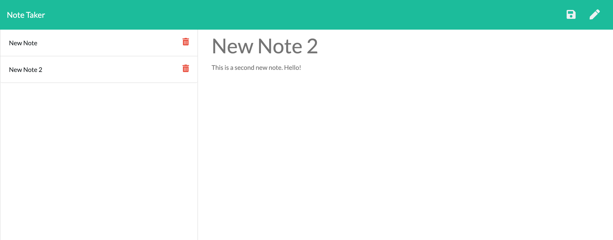

# Note-Taker

-------------------------------------------------- Personal Notes -------------------------------------------------

Deployed Heroku App Link: https://eddiephi-note-taker.herokuapp.com/ 

Description:
I developed the server side of this note-taking application using Node and Express. Users can write new notes, save the notes, and view them afterwards. If needed, the notes can be deleted as well.

Screenshot:

Technologies: HTML5, CSS3, JavaScript, Node.js, Express

License: MIT

I used https://validator.w3.org/nu/ to validate my work.

---------------------------------------------------- Contact ----------------------------------------------------

Email: ephimansone@gmail.com 

LinkedIn: https://linkedin.com/in/eddiephi

GitHub: https://github.com/EddiePhi

Portfolio: https://eddiephi.github.io/EddiePhiPortfolio/